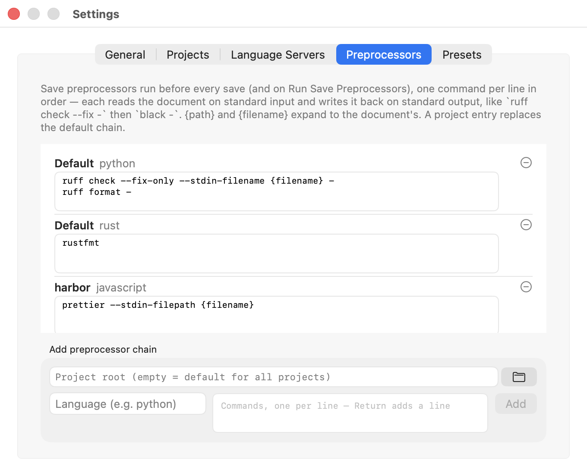

# A tour of the macOS app

Every screen Textchum has, in the order you would meet them. The
screenshots come from a small fictional project — *Harbor*, a port
broker that exists only so these pictures have something honest to
show.

## The window

One document per window, tabs by default, and a navigator drawer with
two halves: the open buffers grouped by project on top, that project's
file tree below.

The title bar carries the facts about the document — encoding, size,
language, and the problem count once a language server has an opinion.
The tree follows along: switching tabs expands the path to the current
file and highlights it.

## Language servers

Diagnostics arrive as tinted marks in the text and a count in the
title bar. Nothing about the editor waits on the server: it attaches
when it can, and says so when it cannot.

Resting the pointer on a symbol shows the server's documentation, with
the Markdown it sends rendered — code blocks monospaced, emphasis
styled. ⌃⌘H asks for the symbol under the caret instead, which works
with mouse hover switched off.

Completions appear as you type after identifier characters and `.`;
↑/↓ choose, ⏎ or ⇥ accept, ⎋ dismisses. A snippet arrives with its
first placeholder selected, so typing replaces it.

**⇧⌘O** lists the file's symbols, filterable from the keyboard.

**View ▸ Language Server Status** answers "is my server alive?" — what
runs where, and the session's recent transitions, refreshed live.

## Finding things

**⌘T** opens files by fuzzy name within the project. The scope is
walked once and matched in memory, so typing stays instant; the status
strip says how many of how many files matched, and which keys do what
— **⏎ searches, ⌘⏎ opens**, so refining a query never opens a file by
accident.

**⇧⌘F** searches contents with a regular expression, with stacked
filters that refine the results by line text or file path. The status
line always says what the search did — matches, files searched, or why
nothing was read.

**⇧⌘P** is the command palette: every menu action, fuzzy-searchable,
with its shortcut alongside.

## Markdown and prose

Markdown documents open with a live preview beside the text, and the
prose spell checker — off until you pick a dictionary — marks
misspellings in purple, distinct from diagnostics. In code it looks
only at comments; identifiers are never flagged.

## Settings

Settings are a plain JSON file that the window edits; the file is the
escape hatch, and it is watched, so an edit in another editor applies
at once.

**Projects** decides how project roots are found, what the tree hides,
and which editor settings a root overrides.

Hidden names are glob patterns, edited one per line, with a menu that
adds a named preset in one click.

**Presets** edits those named sets the same way. They start as
built-ins; edit any of them and your list takes over, so a preset you
delete stays deleted until you restore the built-ins.

**Language Servers** overrides which command serves a language, for
every project or for one root.

**Preprocessors** runs formatters before every save: one command per
line, each reading the document on standard input and writing it back
on standard output.

## Small things

**⇧⌘N** starts a new document in a chosen language, filtered from the
keyboard, so highlighting works before the first save.

And the About panel says which build you are running — a real version,
even for a local build.

